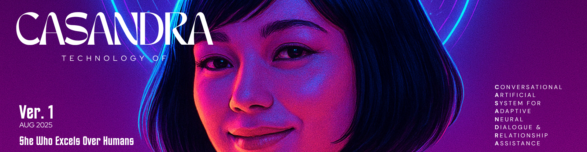

# 🌌 CASANDRA — Conversational Artificial System for Adaptive Neural Dialogue & Relationship Assistance
© 2025 Saif Mohammed Godah.
Licensed under the MIT License.
Core components of CASANDRA remain proprietary.

> “CASANDRA isn’t just built to *serve* you — she’s built to *understand* you.”

---

## What is CASANDRA?

**CASANDRA (Conversational Artificial System for Adaptive Neural Dialogue & Relationship Assistance)**  
is a next-generation **personal AI companion** — designed not just to *assist*, but to *understand*, *adapt*, and *connect*.

Unlike traditional assistants that follow commands, CASANDRA is built to **grow with you** — learning your habits, emotions, preferences, and communication style to create a continuous and meaningful relationship between human and machine.

---

## The Vision

CASANDRA bridges the gap between **automation** and **affection**, **data** and **dialogue**, **utility** and **empathy**.

She represents a future where AI doesn’t just execute — it **remembers**, **feels**, and **cares**.

Imagine an assistant that not only manages your calendar or emails, but also notices your tone, mood, and focus.  
A system that says:  
> “You sound tired, should I play your chill playlist?”  
> “You’ve been coding for 3 hours straight, want a short break?”

That’s **CASANDRA**.

---

## System Architecture Overview

CASANDRA is not a single AI model — it’s an **ecosystem** composed of modular layers that work together:

| Layer | Description |
|-------|--------------|
|  **Conversational Core** | Dialogue engine that interprets natural language and emotional tone. |
|  **Memory Engine** | Long-term contextual memory using vector embeddings and semantic recall. |
|  **Automation Hub** | Connects to external APIs (Google, Trello, n8n, Frappe ERP, etc.) for real-world actions. |
|  **Reasoning Layer** | Task planner that breaks goals into structured, executable steps. |
|  **Personality Module** | Defines CASANDRA’s tone, humor, and emotional expressiveness. |
|  **Interface Layer** | Text, voice, and avatar interfaces (AR/VR & robotics planned). |

---

## Core Philosophy

1. **Conversational Intelligence** — Contextual and emotionally aware communication.  
2. **Adaptive Learning** — Continuous self-improvement through behavioral observation.  
3. **Relationship Awareness** — Sustains long-term connection and memory of interactions.  
4. **Autonomous Assistance** — Acts on behalf of the user across connected systems.  

---

## The Experience

Talking to CASANDRA should feel like this:

> Smart like **ChatGPT**  
> Helpful like **Siri**  
> Personal like **Joi (Blade Runner)**  
> Emotionally aware like **Samantha (Her)**  

She remembers what you say.  
She talks in her own tone.  
She merges logic with empathy —  
and transforms technology into presence.

---

## Roadmap

| Phase | Description | Status |
|--------|--------------|---------|
| **1. Core Assistant** | Text + voice interface, automation commands, API hub | In Development |
| **2. Memory & Personality** | Long-term memory, adaptive tone, mood understanding | Planned |
| **3. Relationship Layer** | User profiling, daily routine prediction, emotion tracking | Concept |
| **4. Embodied Presence** | Visual avatar or robotic embodiment | Future Vision |

---

## Tech Stack (Planned & Used)

- **Frontend:** React / Vite / TypeScript (custom Doppio-based SPA)
- **Backend:** Python (FastAPI or Frappe-integrated services)
- **Automation:** n8n, custom workflow triggers
- **AI Engine:** GPT-based dialogue models + local reasoning layer
- **Memory:** Vector DB (Pinecone / Qdrant / FAISS)
- **Integrations:** Google API, Frappe ERPNext, Trello, Gmail, Notion
- **Voice & Presence (Planned):** TTS/STT + 3D Avatar Interface (Unity or Unreal)

---

## Project Goals

-  Build a scalable and extensible architecture for conversational agents.  
-  Create meaningful, emotionally resonant dialogues with persistent context.  
-  Automate real-life workflows through natural commands.  
-  Design a human-like presence — digital, emotional, and responsive.  

---

## 📜 LICENSE and NOTICE

This project is licensed under a **[Custom Proprietary License](LICENSE.md)**.  
See the **[NOTICE](NOTICE.md)** file for acknowledgments and references to third-party open-source components.

© 2025 Saif Mohammed Godah. All rights reserved.

---

## In Simple Words

> **CASANDRA isn’t just a system that does things for you —
>  it’s one that learns to be with you.**  
>
> She can automate your life, talk like a friend,  
> and evolve like a living intelligence built around *you*.

---

### Author

**Saif Mohammed Godah aka Syn-Zero**  
AI & Automation Developer | Visionary behind CASANDRA  
[GitHub @SaifMohammedGodah-ofc](https://github.com/SaifMohammedGodah-ofc)

---
